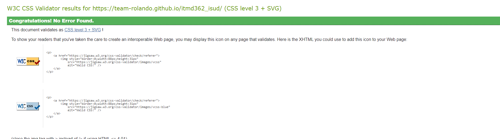

# itmd362_isud

Requirements

• All source files in UTF-8/Unicode character encoding.

• No code-generators like WYSIWYGs, Bootstrap, or other off-the-shelf frameworks

- No frameworks were used as there are no references in the code to such tools.

• HTML, CSS, and JavaScript files should both be indented with 2 spaces per level of indent; indent all CSS style rules inside the declaring block, and further indent all rules and blocks inside your media queries.

- All HTML, CSS and JS files are all indented as required.

• Must pass HTML and CSS validators!

Please check below for HTML and CSS validations:

- HTML

- CSS

• HTML requirements:
6. Only structural, semantic uses of HTML elements and attributes. Absolutely no table markup, break tags, or any other use of HTML to achieve a particular page layout.

- This requirement has been met as all html is semantic-only.

7. Valid HTML form elements, written in conjunction with <label> tags and the for attribute.

- This requirement is achieved in the 'contact us' form in the project.

8. Semantically structured text-based HTML content to accompany any media elements (image, audio, video)

- This has been done for the three included pictures.

• CSS requirements:
9. CSS file should open with a set of reset styles. Meyers, and the Form section of Normalize.

-The Meyers and Normalize form are included in a separate css file.

10. Use at least two min-width media queries to enhance your mobile-first styles for larger screens.

- Two min-width media queries are included.

• JavaScript requirements:
11. JavaScript that throws no uncaught errors and is loaded unobtrusively (no JavaScript event attributes in your HTML, in other words; attach events to any elements requiring interaction).

- JS is loading without errors and is working.

12. JavaScript that uses only asynchronous methods and callbacks

- JS is loaded asynchronously.

• Git requirements:
13. Whole team: A shared team Git repository with frequent commits from each team member and meaningful commit messages that accurately reflect each set of changes.

- Frequent commits were done, although they could be a bit more granular/atomic.

14. Each team member: An individual Git repository with feature branches, frequent commits, and meaningful commit messages that accurately reflect each set of changes that you make, including experimental work that you ultimately might not push upstream to the shared group repository.
All GitHub repositories (team and individual) must contain only the files and commits from this project.

- This is done.